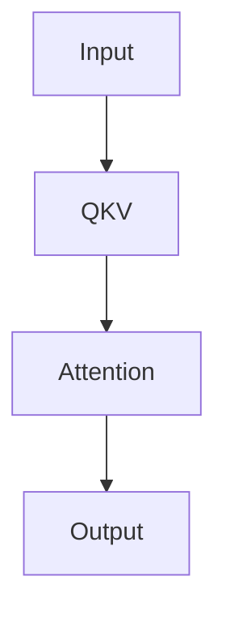

# PRD: mdv - Fast, Beautiful Markdown Viewer

## 1. Product Summary

`mdv` is an ultra-light desktop Markdown viewer that opens Markdown files directly from the terminal.

```sh
mdv lecture.md
mdv README.md
mdv .
```

Users do not need to register an Obsidian-style vault or open a full IDE like VS Code. They point `mdv` at a file or directory, and a Tauri desktop app opens with a polished Markdown rendering experience.

Core philosophy:

- Open fast.
- Render beautifully.
- Support real-world Markdown.
- Stay viewer-only.

## 2. Problem

On macOS, there is no obvious tool for simply viewing Markdown files beautifully.

Obsidian is powerful but vault-based, which is awkward for one-off file viewing. Marked is good but paid. MacDown is old and can run into Gatekeeper or Rosetta issues. VS Code Preview feels like a developer tool. Glow is terminal-first and limited for Mermaid, images, math, and layout.

`mdv` fills that gap.

## 3. Target User

The primary users are developers, students, technical bloggers, and note-takers.

Representative scenario:

- A project folder contains `README.md`, `lecture.md`, and `design.md`.
- The user is working in the terminal and wants to view a document beautifully.
- Registering an Obsidian vault is too much overhead.
- Mermaid diagrams and code blocks must render correctly.
- The app should feel light and fast.

Initial core persona:

```sh
cd ~/Myproject/tiny-transformer
mdv lecture.md
```

A user reads Transformer study notes in a polished Markdown viewer.

## 4. Product Goals

Goals:

1. Open Markdown files instantly from the terminal.
2. Work without vaults, project setup, or accounts.
3. Provide strong GitHub-flavored Markdown support.
4. Render Mermaid diagrams.
5. Support KaTeX math rendering.
6. Highlight code blocks beautifully with Shiki.
7. Auto reload when files are saved.
8. Use Tauri for a lighter desktop footprint than Electron.
9. Provide an `mdv` command through global npm installation.
10. Keep the design simple, polished, and product-grade.

Non-goals for the initial version:

- Vault system
- Backlinks
- Graph view
- Cloud sync
- Accounts or login
- Collaboration
- Plugin marketplace
- Note search app
- WYSIWYG editor

Important principle:

`mdv` is a viewer, not a knowledge management system.

## 5. Core UX

Basic command:

```sh
mdv lecture.md
```

Behavior:

1. The CLI resolves `lecture.md` to an absolute path.
2. The Tauri app launches.
3. The Rust backend reads the file.
4. The Nuxt/Vue frontend renders the Markdown.
5. File changes trigger an automatic reload.

Directory command:

```sh
mdv .
```

Directory resolution priority:

1. `README.md`
2. `readme.md`
3. `index.md`
4. First `.md` file alphabetically
5. Empty state if there are no Markdown files

Expected experience:

The user types `mdv lecture.md`, a desktop viewer opens immediately, and the document appears in a centered reading layout. Code blocks, tables, images, Mermaid diagrams, and math render cleanly. Saving the file updates the viewer automatically.

## 6. MVP Scope

v0.1 must-have CLI:

```sh
mdv <file-or-directory>
mdv --help
mdv --version
```

Supported options:

```sh
mdv lecture.md
mdv .
mdv lecture.md --theme light
mdv lecture.md --theme dark
mdv lecture.md --theme system
mdv lecture.md --no-watch
mdv lecture.md --allow-html
```

Defaults:

- `theme`: `system`
- `watch`: `true`
- `allow-html`: `false`

## 7. Markdown Feature Support

v0.1 must support:

- Headings `h1` through `h6`
- Paragraphs
- Bold
- Italic
- Strikethrough
- Inline code
- Code blocks
- Syntax highlighting
- Blockquotes
- Ordered lists
- Unordered lists
- Nested lists
- Task lists
- Tables
- Links
- Images
- Horizontal rules
- Escaped characters
- Frontmatter
- GitHub-flavored Markdown
- Mermaid code blocks
- Inline math
- Block math
- Heading anchors

Example:

````markdown
# Transformer Note
- [x] Understand Q, K, V
- [ ] Write up multi-head attention



$$
Attention(Q,K,V) = softmax(\frac{QK^T}{\sqrt{d_k}})V
$$
````

## 8. Rendering Engine Decision

`mdv` does not implement a Markdown parser.

Final rendering stack:

- Nuxt + Vue 3
- Pinia
- `unified`
- `remark-parse`
- `remark-gfm`
- `remark-frontmatter`
- `remark-math`
- `remark-rehype`
- `rehype-katex`
- `rehype-slug`
- `rehype-autolink-headings`
- `rehype-sanitize`
- `rehype-stringify`
- Shiki
- Mermaid
- `github-markdown-css` plus custom CSS

Rendering flow:

```text
.md file
-> Rust reads file
-> Nuxt/Vue receives raw Markdown
-> unified parses Markdown
-> remark-gfm handles GitHub-flavored Markdown
-> remark-math handles math syntax
-> rehype-katex renders math
-> rehype-slug adds heading ids
-> rehype-autolink-headings adds heading anchors
-> Vue DOM enhancement handles Mermaid, Shiki, local images, and heading bookmarks
-> sanitized HTML output
```

Reasons:

- Use a proven Markdown ecosystem.
- Keep AST-based extension easy.
- Keep Vue components focused on state, events, and DOM enhancement.
- Safely customize special blocks such as Mermaid, Shiki, and KaTeX.

## 9. Mermaid Support

Markdown input:

````markdown

````

Rendering approach:

1. Detect `mermaid` as the code block language.
2. Do not render it as a normal code block.
3. Pass it into `MermaidBlock`.
4. Generate SVG with Mermaid.
5. If rendering fails, show an error state for that block only.

Requirements:

- Support flowcharts.
- Support `sequenceDiagram`.
- Support `classDiagram`.
- Support `stateDiagram`.
- Support `erDiagram`.
- Treat `gantt` as best-effort.
- Invalid syntax must not crash the app.
- Sync Mermaid theme with app theme.

Error handling:

- Show `Could not render Mermaid diagram.`
- Show the original Mermaid code block.
- Keep detailed errors collapsible.
- Render the rest of the document normally.

## 10. Code Highlighting

Code highlighting uses Shiki.

Minimum supported languages:

- TypeScript
- TSX
- JavaScript
- JSX
- Go
- Rust
- Python
- Java
- Kotlin
- Swift
- SQL
- Bash
- Zsh
- Shell
- JSON
- YAML
- TOML
- Dockerfile
- Markdown
- HTML
- CSS

Code block UI requirements:

- Language label
- Copy button
- Horizontal scrolling
- Rounded corners
- Comfortable padding
- Light and dark theme support
- Plain text fallback for unknown languages

## 11. Math Support

Math uses `remark-math` and `rehype-katex`.

Supported syntax:

- Inline math: `$E = mc^2$`
- Block math:

```text
$$
Attention(Q,K,V) = softmax(\frac{QK^T}{\sqrt{d_k}})V
$$
```

Requirements:

- Render inline math.
- Render block math.
- Include KaTeX CSS.
- Fall back to the original expression when rendering fails.

## 12. File Handling

Open file:

```sh
mdv lecture.md
```

Requirements:

- Relative paths
- Absolute paths
- Paths with spaces
- `.md` and `.markdown`
- Clear error if the file does not exist

Open directory:

```sh
mdv .
```

Resolution priority:

1. `README.md`
2. `readme.md`
3. `index.md`
4. First Markdown file alphabetically
5. Empty state if none exists

Relative assets:

```markdown

```

Requirements:

- Use the Markdown file location as the base path.
- Convert relative images into Tauri-safe asset URLs.
- Show a missing image placeholder when the asset cannot be loaded.

Local Markdown links:

v0.1 default behavior:

- External URL opens in the default browser.
- Relative `.md` links are planned for v0.2.

v0.2 goal:

- Open relative `.md` links in the same `mdv` window.

## 13. Auto Reload

Watch mode is enabled by default:

```sh
mdv lecture.md
```

Disable it:

```sh
mdv lecture.md --no-watch
```

Requirements:

- Reload content when the file is saved.
- Preserve scroll position when possible.
- Minimize visual flicker during reload.
- Show an error state if the file is deleted.
- Watch image changes in v0.2.

## 14. UI and Design Requirements

Design keywords:

- Minimal
- Powerful
- Reading-first
- Developer-friendly
- Premium but calm

Reference feel:

- GitHub README
- Linear docs
- Raycast
- Apple Preview
- Notion reading mode

Layout:

```text
+----------------------------------------------+
| lecture.md                         Watching  |
+----------------------------------------------+
|                                              |
|              Markdown content                |
|        max-width: 820px, centered             |
|                                              |
+----------------------------------------------+
```

Top bar:

- File name
- Watching status
- Theme toggle
- Copy path or reveal in Finder action

v0.1 keeps this simple:

```text
lecture.md                                      Watching
```

Document area:

- `max-width: 820px`
- Centered layout
- Desktop padding: `48px 32px`
- Small-window padding: `24px 18px`
- `line-height: 1.65`
- Body font size: `16px`

Typography:

- Body font: `system-ui, -apple-system, BlinkMacSystemFont, "Segoe UI", sans-serif`
- Code font: `ui-monospace, SFMono-Regular, Menlo, Monaco, Consolas, monospace`
- Body size: `16px`
- Code size: `14px`
- Heading weight: `650` to `750`

Theme defaults:

- System theme

Light theme:

- Near-white background
- Near-black text
- Muted gray text
- Subtle gray borders
- Light elevated code block surface
- Calm blue links

Dark theme:

- Near-black background
- Soft-white text
- Muted gray text
- Subtle dark borders
- Dark elevated code block surface
- Soft blue links

Principle:

- No flashy colors.
- Accent color only for links, active states, and focus states.

## 15. Error States

File not found:

```text
Could not find file: lecture.md
```

Show:

- Input path
- Current working directory

No Markdown files:

```text
No Markdown files found in this directory.
```

Show:

- Directory path
- Usage example: `mdv README.md`

Permission error:

```text
Permission denied while reading this file.
```

Mermaid error:

```text
Could not render Mermaid diagram.
```

Requirements:

- Keep rendering the rest of the document.
- Replace only the diagram with an error block.
- Show the original Mermaid code.

Markdown rendering error:

```text
Could not render this Markdown file.
```

Requirements:

- Provide raw text fallback when possible.
- Do not crash the app.

## 16. Technical Architecture

Final stack:

- Tauri v2
- Rust backend
- Nuxt + Vue 3 + TypeScript frontend
- Pinia
- `unified`
- `remark-parse`
- `remark-gfm`
- `remark-frontmatter`
- `remark-math`
- `remark-rehype`
- `rehype-katex`
- `rehype-slug`
- `rehype-autolink-headings`
- `rehype-sanitize`
- `rehype-stringify`
- Shiki
- Mermaid
- `github-markdown-css`
- pnpm workspace
- npm CLI wrapper

Architecture:

```text
npm global CLI
  |
resolve file or directory path
  |
launch Tauri desktop app with path argument
  |
Rust backend reads file
  |
Nuxt/Vue frontend renders Markdown
  |
file watcher emits update event
  |
frontend re-renders
```

## 17. Project Structure

Recommended structure:

```text
mdv/
├── apps/
│   └── desktop/
│       ├── nuxt.config.ts
│       ├── src/
│       │   ├── app.vue
│       │   ├── components/
│       │   │   ├── AiPanel.vue
│       │   │   ├── MarkdownView.vue
│       │   │   ├── TopBar.vue
│       │   │   ├── SettingsPanel.vue
│       │   │   ├── OutlinePanel.vue
│       │   │   ├── EmptyState.vue
│       │   │   └── ErrorState.vue
│       │   ├── composables/
│       │   │   ├── useAppLifecycle.ts
│       │   │   ├── useTauriRuntime.ts
│       │   │   └── useThemeSync.ts
│       │   ├── lib/
│       │   │   ├── markdown.ts
│       │   │   ├── readerSettings.ts
│       │   │   ├── shiki.ts
│       │   │   ├── theme.ts
│       │   │   └── types.ts
│       │   ├── stores/
│       │   │   └── app.ts
│       │   └── styles/
│       │       ├── app.css
│       │       └── markdown.css
│       ├── src-tauri/
│       │   ├── src/
│       │   │   ├── main.rs
│       │   │   ├── commands.rs
│       │   │   └── watcher.rs
│       │   ├── tauri.conf.json
│       │   └── Cargo.toml
│       └── package.json
│
├── packages/
│   └── cli/
│       ├── bin/
│       │   └── mdv.js
│       ├── src/
│       │   └── index.ts
│       └── package.json
│
├── package.json
├── pnpm-workspace.yaml
├── README.md
└── PRD.md
```

## 18. Rust Backend Responsibilities

The Rust/Tauri backend handles:

- File path resolution
- File reads
- Markdown file selection inside directories
- File watching
- App launch arguments
- Relative asset path support
- OS integration

Required commands:

- `read_markdown(path)`
- `resolve_input_path(input_path)`
- `get_file_metadata(path)`
- `watch_file(path)`
- `reveal_in_finder(path)` in v0.2

## 19. Frontend Responsibilities

The Nuxt/Vue frontend handles:

- Markdown rendering
- Mermaid rendering
- Shiki code highlighting
- KaTeX math rendering
- Theme switching
- Top bar
- Error states
- Loading states
- Copy code button
- Scroll preservation

Core components:

- `App`
- `AiPanel`
- `TopBar`
- `MarkdownView`
- `SettingsPanel`
- `OutlinePanel`
- `FindPanel`
- `EmptyState`
- `ErrorState`

## 20. CLI Specification

Command:

```sh
mdv [path] [options]
```

Arguments:

- `path`: Markdown file or directory

If `path` is omitted, it is equivalent to:

```sh
mdv .
```

Options:

- `--theme <light|dark|system>`
- `--no-watch`
- `--allow-html`
- `--version`
- `--help`

Examples:

```sh
mdv
mdv .
mdv README.md
mdv docs/design.md
mdv lecture.md --theme dark
mdv lecture.md --no-watch
```

## 21. Packaging and Distribution

Initial local development:

```sh
pnpm install
pnpm dev
pnpm build
pnpm link --global
mdv lecture.md
```

npm package:

- Public package: `@ejaebbang/mdv`
- Binary command: `mdv`

Future platform packages:

- `@ejaebbang/mdv`
- `@ejaebbang/mdv-darwin-arm64`
- `@ejaebbang/mdv-darwin-x64`
- `@ejaebbang/mdv-linux-x64`
- `@ejaebbang/mdv-win32-x64`

v0.1 target:

- macOS Apple Silicon only

## 22. Security Requirements

Default policy:

- Raw HTML disabled by default
- Script execution disabled
- Minimize external remote content loading
- No arbitrary shell execution
- File access limited to explicitly opened files and their permitted local assets

`--allow-html` may be provided, but it is disabled by default:

```sh
mdv lecture.md --allow-html
```

Notes:

- `allow-html` is for local trusted documents.
- Default mode should prefer sanitization.

## 23. Performance Requirements

Initial targets:

- Small Markdown files open quickly.
- 1 MB Markdown files render without freezing.
- Documents with 100 code blocks remain usable.
- Mermaid-heavy documents may be slower but must not crash.
- Reload after save feels natural.

Qualitative bar:

- Lighter than Electron.
- Faster than opening VS Code just to read Markdown.

## 24. MVP Acceptance Criteria

v0.1 is complete when:

- `pnpm build` succeeds.
- `npm link` exposes the `mdv` command.
- `mdv lecture.md` opens the Tauri app.
- `mdv .` opens `README.md` or the first Markdown file.
- Headings, lists, tables, task lists, and code blocks render.
- Shiki syntax highlighting works.
- Mermaid diagrams render.
- KaTeX math renders.
- Relative images render.
- File saves trigger auto reload.
- Light, dark, and system themes work.
- Raw HTML does not execute by default.
- There is no Obsidian-style vault registration step.

## 25. Future Roadmap

v0.2:

- Table of contents sidebar
- Relative `.md` link navigation
- Export to HTML
- Export to PDF
- Recent files
- Reveal in Finder
- Better image watching
- Print mode

v0.3:

- Directory sidebar
- Multi-tab support
- Search within document
- Custom CSS
- Theme presets
- Command palette
- Auto updater
- Cross-platform release

v1.0:

- Stable npm installation
- macOS arm64 and x64 support
- Linux support
- Windows support
- Signed macOS app
- Documentation site
- Polished release pipeline

## 26. Product Principle

Every feature must pass this question:

```text
Does this make reading Markdown files faster, clearer, or more beautiful?
```

If not, do not add it.

Final product definition:

`mdv` is the fastest way to open a Markdown file beautifully from your terminal.
