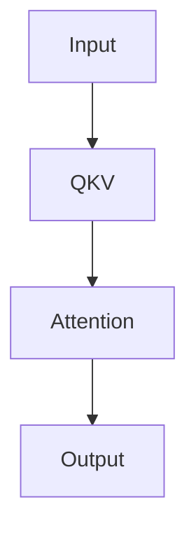

# Transformer Note

- [x] Understand Q, K, V
- [ ] Write up multi-head attention

`mdv` renders GitHub-style Markdown, Mermaid diagrams, math, images, and highlighted code.

## Mermaid



## Math

Inline math works: $E = mc^2$.

$$
Attention(Q,K,V) = softmax(\frac{QK^T}{\sqrt{d_k}})V
$$

## Code

```go
package main

import "fmt"

func main() {
    fmt.Println("hello mdv")
}
```

## Table

| Feature | Status |
| --- | --- |
| GFM | Ready |
| Mermaid | Ready |
| KaTeX | Ready |
| Shiki | Ready |
